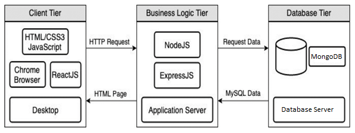

# T3A1 - WORKBOOK
#### By David Johnson

## Question 1 
```
Provide an overview and description of a standard source control process for a large project
```
As stated in my T2A1 Workbook, source control (or version control) is the practice of tracking and managing changes to code. 

Usually, a source code management (SCM) system is utilized to streamline the development process and to provide a centralized source for all of the code.

SCM systems allow the tracking of code changes, revision history for the code, and the ability to revert to previous versions of a project when needed. 

A standard process for managing source control is as follows:
1.	Use a source control system.
2.	Keep your source code in source control 
3.	Ensure the working file is from the latest version of the source file.
4.	Only check-out the file being worked upon.
5.	Check in immediately after alterations are completed.
6.	Review every change before committing. 
7.	Commit often 
8.	Make extensive, detailed notes in the check-in comments about why the changes were made.

By using a SCM system (for example, Git), teams can collaborate on code, isolate work until it is ready, and quickly trouble-shoot issues by identifying who made the changes, and what the changes were. This is of great importance when teams are working together on large projects.


*image stolen from https://www.smartsheet.com/*

The diagram above is a great example of Distributed Version Control. At a high level, the process is as follows:

Each developer will **PULL** the most recent code from the Main Repository, they will then **BRANCH** the code depending on what they are intending to work on (and work on this code on their local device).  Once the desired changes/updates have been made, the developer will **COMMIT** and **PUSH** the updated code to be **MERGED** with the Main Repository.  

A popular framework used in large projects is Gitflow - a strict branching model that the whole team must adhere to.  Gitflow ususally consists specified branches such as Master,  Release, Develop, Feature and Hotfix.

## Question 2
```
What are the most important aspects of quality software?
```

*image stolen from http://www.davidchappell.com*

The aspects of quality software can be divided into three specific areas:
- Process Quality: The quality of the practices, processes and procedures used by the Development Team.
- Structural Quality: The quality of the actual codebase. 
- Functional Quality: The overall quality of the software experienced by the end user.

Quality software must be:

**Usable:** Needless to say the software needs to be completely seamless and free of defects for the end user.

**Reliable:** it must work EVERY TIME and be free of bugs 

**Understandable:** many team members will come and go throughout the life of a large organisation, and it is of vital impratnce that the code is understandable to anyone new joining the team.  This is achieved by practices such as commenting code and documentation in order to avoid technical debt.

**Modifiable:** The software neeeds to be able to be modified depending on new and changing business requirements. 

**Scalable:** Most successful business will need to scale at some point, and by allowing for this possiblilty from the very beginning, this can save a lot of work down the road. 

**Testable:** A high level of testability ensures easy and early detection of bugs and defects in  software thereby saving on cost and time.

**Portable:** Quality software needs the ability to be run on multiple different devices and operating systems. 

**Efficient:** It is important for quality software to be as efficient as possible in order to optimize performance and get the maximum retorn on efforts. 

## Question 3
```
Outline a standard high level structure for a MERN stack application and explain the components
```

*image stolen from https://www.mongodb.com/*


*image stolen from https://levelup.gitconnected.com/*

4 components: provide an end-to-end framework for developers to work in
Mongo DB:
Express.js
React
Node.js
 

## Question 4
```
A team is about to engage in a project, developing a website for a small business. What knowledge and skills would they need in order to develop the project?
```

A competent team will require skills and knowledge in the following areas:

- An understanding of the business and what the client is trying to achieve,

- Programming/technical knowledge (html/css/backend) as well as the ongoing updates/changes to individual programming languages,

- Testing procedures and practices,

- Basic design/responsive design,

- Graphics creation and manipulation eg image resizing, effects and graphic design - and the programs used to make this happen (Photoshop, Illustrator, Indesign etc),

- A basic understanding of marketing and SEO (Search Engine Optimization)

- A great uderstanding of common security attacks and how to prevent them,

- Project management methodologies (eg. Agile implementation),

- Time Management and Detailed Planning

- Ability to write quality documentation,

- Ability to deploy/host the website,

- Soft skills such as conversational, negotiation, patience, emotional intelligence, resilience


## Question 5
```
With reference to one of your own projects, discuss what knowledge or skills were required to complete your project, and to overcome challenges
```
I would like to refer to my marketplace project - Rad Kelly's Beard Exchange.


*I own this image and you cannot have it*

I required a great deal of knowldege and skills to create this application.

User Stories and wireframes
Ruby
Rails
MVC
Routes
CRUD
Git
Relational Database
Photoshop and Illustrator
AWS
Heroku
HTML
CSS and SCSS
Bootstrap


First I needed an understanding of the Ruby Programing Language and the Rails Applicatoin Framework.

Rails followed the MVC structure and used PostgresSQL database.

To overcome technical challenges, 

Work it out myself using debugging tools


I would first try and find an online source but in the absence of that I utilized my peers and educators to help me with these technical issues.  

To overcome emotional challenges
With regards to my mindset, I practiced guided breathing and meditation - especially during the more stressful times.


## Question 6
```
With reference to one of your own projects, evaluate how effective your knowledge and skills were for this project, and suggest changes or improvements for future projects of a similar nature
```

I would like to make mention of my most recent project for the Coder Academy Hackathon -  Read it 'n' Wipe.


*I own this image and you cannot have it*

Coming into the project I wasn't entirely sure where my knowledge and skills were at.  I thought I was keeping up with my studies as each day we go through content one component at a time, and by listening in, I was confident I understood what is going on

When you then have to go and build something from scratch using everything you have learnt, it turns out it was a completely different story. but never an entire project from start to finish.  

I had a great idea for the business, and was able to contribute to the overall outcome with things such as wireframes, logo designs and creating content for the site, but the actual back-end and functionality I was amazed at how much I still didn't know.  

I was fortunate enough to be in a team with some very bright individuals, and was fortunate enough to follow along with what they were doing 


Using this as a valuable lesson, some improvements I will make in similar projects is

Planning and user stories
Work better collaboratively
More personal practice
Gain a better understanding of MERN 
Gain a better understanding of HTML/CSS


## Question 7
```
Explain control flow, using an example from the JavaScript programming language
```
The control flow is the order in which the computer executes statements in a script. ... A typical script in JavaScript or PHP (and the like) includes many control structures, including conditionals, loops and functions. Parts of a script may also be set to execute when events occur.

## Question 8
```
Explain type coercion, using examples from the JavaScript programming language
```

Type coercion is the process of converting value from one type to another (such as string to number, object to boolean, and so on). Any type, be it primitive or an object, is a valid subject for type coercion. To recall, primitives are: number, string, boolean, null, undefined

## Question 9
```
Explain data types, using examples from the JavaScript programming language
```
In JavaScript, there are 6 primitive data types: string, number, boolean, null, undefined, symbol (new in ECMAScript 2015)

## Question 10
```
Explain how arrays can be manipulated in JavaScript, using examples from the JavaScript programming language
```
As you can see, JavaScript gives you some powerful ways to manipulate arrays — you can alter the elements at the start of an array with unshift() and shift() , modify the end of an array with push() and pop() , and add or remove elements at any point in an array with splice()


## Question 11
```
Explain how objects can be manipulated in JavaScript, using examples from the JavaScript programming language
```
In JavaScript objects are simply a data structure made up of key-value pairs. A blueprint for an object can be made by using a function that acts as a constructor function for the objects. You can also create an object literal that will result in a single object that you can't duplicate

## Question 12
```
Explain how JSON can be manipulated in JavaScript, using examples from the JavaScript programming language
```

Stringify, parse and DOM manipulation

## Question 13
```
For the code snippet provided below, write comments for each line of code to explain its functionality. In your comments you must demonstrates your ability to recognise and identify functions, ranges and classes
```

**Code Snippet:**

```javascript
//creation of Car class (parent class) - this will specify the shared properties and methods that object produced from this class will have
class Car {
//constructor() method - this is used to set initial values of the object. Javascript calls the constructor() method every time it creates a new instance of the class.
  constructor(brand) {
//In the context of class "this" refers to an instance of that class.  In class Car,  "this" is used to set the value of the Car instance's carname property to the brand argument. 
    this.carname = brand;
  }
//class method created called present()
  present() {
//when the present() method is called it will return a string "I have a" followed by the property set in the constructor)    
    return 'I have a ' + this.carname;
    
  }

}
//creation of Car class (child class) - this will have access to all of the instance properties and methods of the parent class and can add it's own properties and methods in addition to these.
class Model extends Car {
//constructor() method including argument "brand" from Car class and new argument "mod"
  constructor(brand, mod) {
// The child class constructor calls the parent class constructor using this super()method
    super(brand);
     //"this" is used to set the value of the Model instance's model property to the mod argument. 
    this.model = mod;
  }
  //class method created called show()
  show() {
     
    return this.present() + ', it was made in ' + this.model;
  }
}

let makes = ["Ford", "Holden", "Toyota"]
let models = Array.from(new Array(40), (x,i) => i + 1980)

function randomIntFromInterval(min,max) { // min and max included
    return Math.floor(Math.random()*(max-min+1)+min);
}

for (model of models) {

  make = makes[randomIntFromInterval(0,makes.length-1)]
  model = models[randomIntFromInterval(0,makes.length-1)]
    
  mycar = new Model(make, model);
  console.log(mycar.show())
}
```